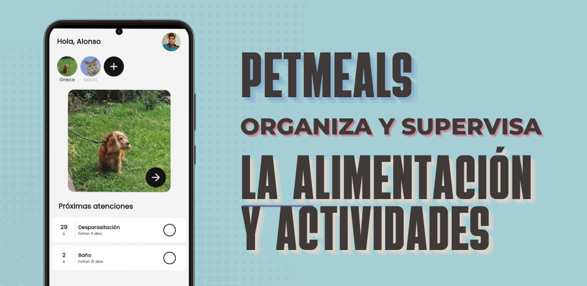

# 👋 Hi, I’m @joalmr
- 👀 I’m interested in Supabase, Firebase, Flutter, React-Native, Swift, React, Svelte, Next.js & Node.js
- 💞️ I’m looking to collaborate on Flutter & React

Currently, I work on this [repository](https://github.com/joalmr/petmeals), developed with Flutter and Firebase.

You can try it on [Google Play](https://play.google.com/store/apps/details?id=com.joalmr.petmeals)

I have other apps that you can check [Calcula tu hipoteca](https://play.google.com/store/apps/details?id=com.aedev.hipoteca) & [Simula tu préstamo](https://play.google.com/store/apps/details?id=com.aedev.prestamo)

<!---
joalmr/joalmr is a ✨ special ✨ repository because its `README.md` (this file) appears on your GitHub profile.
You can click the Preview link to take a look at your changes.
--->
